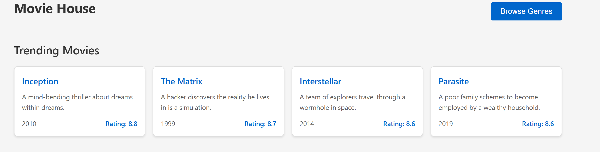
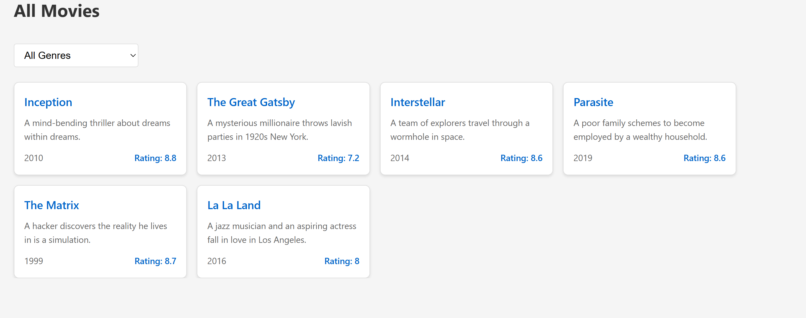
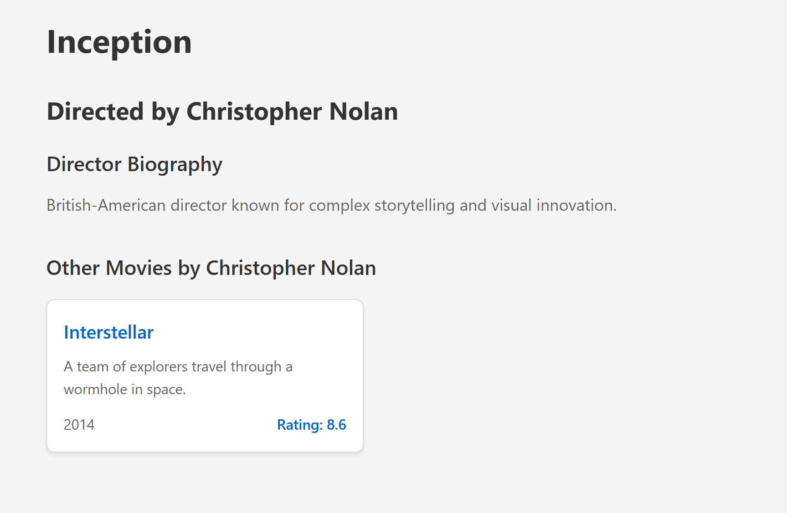
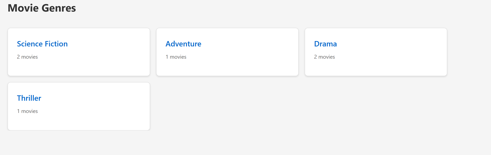
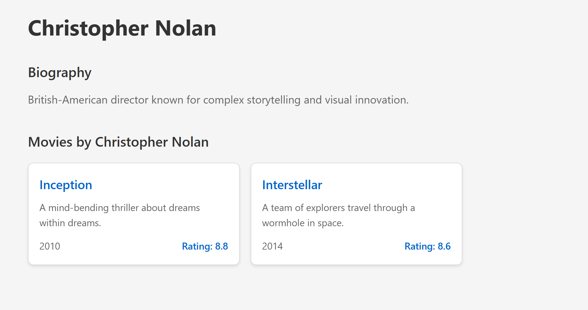

# Advanced Programming Assignment 2
## Movie House - Next.js Movie Directory

A movie directory application built with Next.js demonstrating various rendering patterns and routing strategies.

## Pages and Features

### Home Page (`/index.js`)
- Displays trending movies section
- Browse Genres button for navigation
- Uses `getStaticProps()` with ISR (revalidate: 3600)
- Shows 404 when data not found

### Movies Page (`/movies`)
- Lists all movies in card format
- Genre-based filtering via select input
- Links to individual movie pages
- Implements ISR with `getStaticProps()`
- 404 handling for missing data

### Movie Details (`/movies/[id]`)
- Complete movie information:
  - Title
  - Description  
  - Director (with link to director page)
  - Release Year
  - Rating
- Uses `getStaticPaths` and `getStaticProps`
- Implements fallback pages for on-demand generation
- used ISR since we are using ISR for /movies, therefore there is the assumption that movies details can be updated, thus ISR also seems valid for movie details page

### Movie Director Page (`/movies/[id]/director`) 
- Detailed director information of a specific movie
  - Director Name
  - Director Biography
  - Other Movies by this Director
- SSG since /movies and /movies/[id] are also SSG and this will also load up the page since there is minimal user interactivity on this page
- ISR because details of movies can be updated which can include director (incase wrong director was selected in the data first time)

### Help Section (`/help/[...slug]`)
Catch-all routes for help pages:
- `/help/faqs`  
- `/help/contact`
- `/help/privacy`

### Help Section Index route (`/help/index.js`)
Since /help/[...slug] can't catch /help, therefore created this file to catch /help, another solution was [[...slug]]

### Custom 404 Page
- User-friendly error message
- "Go Home" navigation button

### Genres Page (`/genres`)
- Server-side rendered with `getServerSideProps()`
- Lists genres with movie counts
- Links to genre-specific pages

### Genre Details (`/genres/[id]`)
- Server-side rendered filtered movie list
- Shows all movies in selected genre

### Directors Page (`/directors/index.js`)
- Client-side rendered using `useSWR`
- for SWR, needed an api , so created api route `/api/directors`
- Displays Card for each director
- Each card links to details page of director
- Each card Displays:
  - Director name
  - Biography
  - Count of Movies directed

### Director Details Page (`/directors/[id].js`)
- Client-side rendered using `useSWR`
- for SWR, needed an api , so used api route `/api/directors`
- Displays:
  - Name
  - Biography
  - Movies Cards

